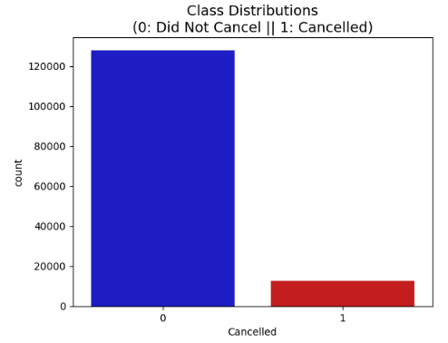
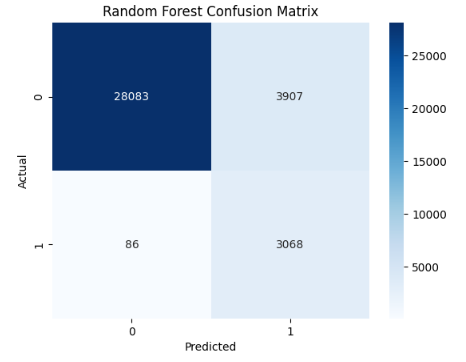
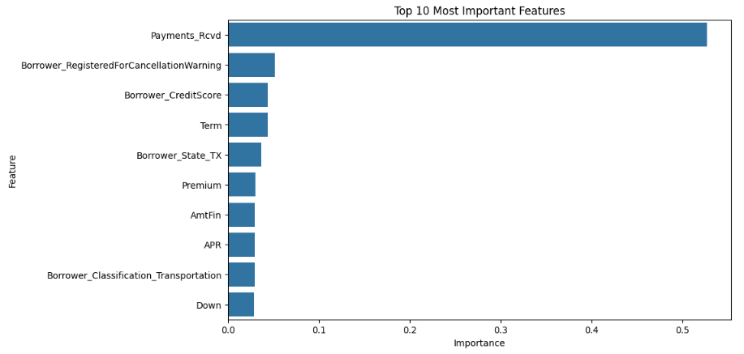

# 📊 Loan Cancellation Prediction Model

## 🚀 Project Overview

This project analyzes historical loan data to predict whether a loan will cancel before reaching its maturity date. A machine learning model was developed to identify loans at high risk of cancellation and uncover the factors most strongly associated with cancellation behavior.

The project combines **machine learning**, **exploratory data analysis (EDA)**, **feature engineering**, and **data visualization** techniques to generate actionable business insights and support data-driven decision-making.

---

## 📷 Project Visualizations

| Class Distribution | Confusion Matrix |
|-------------------|------------------|
|  |  |

### Feature Importance



---

## 🎯 Objectives

- Predict whether a loan will cancel before maturity
- Identify the key drivers behind loan cancellations
- Analyze relationships between loan characteristics and cancellation outcomes
- Improve business understanding of customer loan behavior
- Evaluate strategies for handling class imbalance and optimizing model performance

---

## 🛠️ Technologies & Tools

- **Python**
- **Pandas**
- **Scikit-learn**
- **Imbalanced-Learn (SMOTE)**
- **Matplotlib**
- **Seaborn**
- **Jupyter Notebook**

---

## 🤖 Machine Learning Model

A **Random Forest Classifier** was implemented to predict loan cancellations using borrower, financing, and payment-related features.

### 📌 Why Random Forest?

Random Forest was selected because it:

- Handles large datasets efficiently
- Performs well with nonlinear relationships
- Reduces overfitting through ensemble learning
- Provides feature importance metrics for interpretability
- Requires minimal feature scaling and preprocessing

---

## 🔍 Methodology

### 🧹 1. Data Preparation

- Cleaned and preprocessed historical loan data
- Identified and handled missing values
- Converted categorical variables using one-hot encoding
- Selected relevant features for modeling

### 📈 2. Exploratory Data Analysis (EDA)

- Examined class imbalance within the target variable
- Created visualizations to identify trends and patterns
- Performed correlation analysis between loan characteristics and cancellations
- Investigated relationships between key variables and cancellation outcomes

### ⚙️ 3. Feature Engineering & Preprocessing

- Encoded categorical variables using `pd.get_dummies()`
- Split data into training and testing datasets
- Applied **SMOTE (Synthetic Minority Oversampling Technique)** to address class imbalance
- Evaluated feature importance using Random Forest

### 🌲 4. Model Development

- Trained a Random Forest classification model
- Tuned the classification threshold to improve recall
- Evaluated multiple feature combinations and model configurations

### 📊 5. Model Evaluation

Because the business objective was to identify loans likely to cancel, **Recall** was prioritized to minimize false negatives.

#### ✅ Final Results

| Metric | Score |
|----------|----------:|
| Accuracy | **88.6%** |
| Recall | **97.3%** |
| Precision | **44.0%** |
| F1 Score | **60.6%** |

The classification threshold was adjusted to **15%**, allowing the model to identify nearly all loan cancellations while maintaining strong overall accuracy.

---

## 📈 Key Findings

- **Payments Received (`Payments_Rcvd`)** was the most influential predictor of loan cancellation behavior.
- Loan financing characteristics such as **Premium**, **Amount Financed (`AmtFin`)**, **APR**, and **Down Payment** contributed significantly to model predictions.
- Applying **SMOTE** improved the model's ability to identify minority-class observations.
- Threshold tuning substantially increased recall compared to the default Random Forest configuration.

---

## 💡 Key Skills Demonstrated

- Machine Learning
- Predictive Modeling
- Feature Engineering
- Data Cleaning & Preprocessing
- Exploratory Data Analysis (EDA)
- Data Visualization
- Class Imbalance Handling (SMOTE)
- Model Evaluation & Optimization
- Python Programming
- Statistical Analysis

---

## 📚 Key Takeaways

This project demonstrates how machine learning can be leveraged to better understand customer behavior and improve decision-making within the financial industry. By combining predictive modeling with exploratory analysis, the project provides a data-driven approach to identifying and understanding loan cancellation risk.

---

## 🔮 Future Improvements

- Compare additional machine learning models (**XGBoost**, **Logistic Regression**, **Neural Networks**)
- Perform hyperparameter tuning using **GridSearchCV**
- Implement cross-validation for more robust evaluation
- Deploy the model as an interactive dashboard or web application
- Incorporate additional borrower and financial data sources

---

## ⚙️ Installation

Clone the repository:

```bash
git clone https://github.com/your-username/Loan-Cancellation-Prediction-Model.git
````

Install dependencies:

```bash
pip install -r requirements.txt
```

Run the notebook or Python script to reproduce the analysis and model results.

---

## 📁 Repository Structure

```text
Loan-Cancellation-Prediction/
│
├── README.md
├── LICENSE
├── requirements.txt
├── loan_cancellation_model.py
│
├── notebooks/
│   └── Loan_Cancellation_Model.ipynb
│
└── images/
```

---

## 👤 Author

**Brian Kassin**

Management Information Systems Graduate | Data Analytics | Machine Learning | QA & Agile Professional
